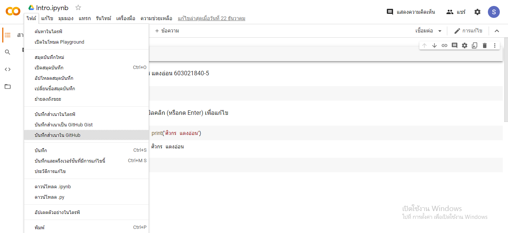
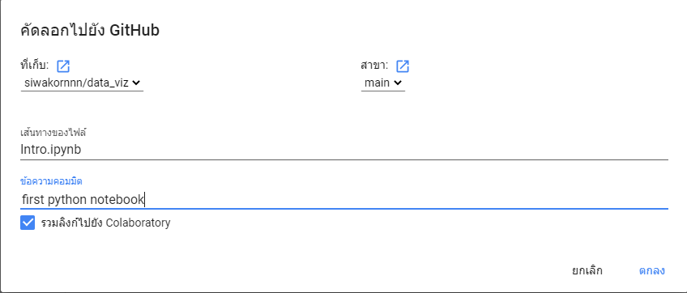

# data_viz

ศิวกร แตงอ่อน 603021840-5

# การบ้านครั้งที่ 1 

ขั้นตอนการบันทึกไฟล์จาก Google colab ไปยัง github

ไปยังเมนู ไฟล์ และเลือก บันทึกสำเนาใน Github

เลือกจัดเก็บไฟล์ใน Github และ พิมพ์ข้อความการเปลี่ยนแปลง(Commit Message) จากน้้นกด ตกลง

